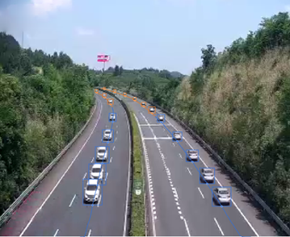

<div align="center">

# LoRFT / Map-RSTNet

**Benchmarking Long-Range Vehicle Trajectory Reconstruction from Fixed Highway Cameras**

<p>
  <a href="#overview">Overview</a> |
  <a href="#dataset">Dataset</a> |
  <a href="#quick-start">Quick Start</a> |
  <a href="docs/PIPELINE.md">Pipeline</a>
</p>

<p>
  
  
  
  <a href="https://docs.google.com/forms/d/e/1FAIpQLSer9Cav6uK0TNWvOWlwRzrPQ4V-4YcMjrBrUFYX9jXlYNj9tA/viewform?usp=header">
    
  </a>
</p>

</div>

<p align="center">
  
</p>

## Overview

**LoRFT is, to our knowledge, the first benchmark for long-range vehicle trajectory reconstruction from fixed highway cameras.** The task is to recover the distant continuation of the same vehicle from a reliable near-field tracklet in the original fixed-camera image plane.

Fixed highway cameras are widely deployed for continuous traffic monitoring, but automatic tracking often becomes fragmented or terminates early in distant road regions because of perspective compression, scale decay, occlusion, and unstable association. LoRFT provides manually verified observed/reference trajectory pairs for studying this near-to-far reconstruction problem.

This repository includes the LoRFT processed trajectory data, road-geometry annotations, evaluation pipeline, and Map-RSTNet reference model.

## Dataset

**LoRFT Fixed-Camera Highway Trajectory Reconstruction Dataset**

**Dataset Scale:** 22 expressway surveillance scenes, 366,109 video frames, 6,601 manually verified vehicle trajectories, and 2,694,889 vehicle bounding boxes.

**Data Distribution:** 14 training scenes, 4 validation scenes, and 4 test scenes under a scene-level split.

**Video Setting:** Fixed highway surveillance videos collected from roadside and gantry-mounted cameras at 25 FPS and 352 x 288 resolution.

**Annotation Quality:** Provides observed/reference trajectory labels, vehicle bounding boxes, track identities, and scene-level road-geometry annotations.

**Research Value:** Provides a standardized benchmark for evaluating long-range vehicle trajectory reconstruction under fixed-camera perspective degradation.

### Annotation Protocol

Each GT row follows the 10-column tracking format:

```text
frame,id,x,y,w,h,c,d,e,label
```

- `label=0`: manually verified observed segment used as model input.
- `label=1`: manually verified distant reference segment used for evaluation.

The observed and reference segments belong to the same fixed-camera trajectory. They do not necessarily indicate chronological order; depending on traffic direction and camera placement, the distant reference segment may appear later or earlier in video time.

### Data Layout

```text
data/
|-- gt/
|   `-- <scene>/<clip>/gt/gt.txt
|-- map_files/
|   `-- <scene>.json
`-- README.md
```

The map JSON files contain scene-level road centerlines, road boundaries, and traffic-direction metadata. Original videos are distributed separately under controlled access.

**Video Data Access:** To request access to the LoRFT video data, please complete the following form:

- [LoRFT Video Data Request Form](https://docs.google.com/forms/d/e/1FAIpQLSer9Cav6uK0TNWvOWlwRzrPQ4V-4YcMjrBrUFYX9jXlYNj9tA/viewform?usp=header)

Applicants should download and sign the agreement linked in the request form, upload the signed agreement to a cloud drive with view permission enabled, and submit the shared link in the form.

## Map-RSTNet

Map-RSTNet is a map-aware residual Seq2Seq LSTM reference model for LoRFT. It represents image-space trajectories in a road-aligned state space, aligns bidirectional traffic, reconstructs the distant segment autoregressively, and projects the reconstructed trajectory back to the image plane.

The default setting uses 60 observed frames and reconstructs a 125-frame distant segment at 25 FPS.

## Quick Start

Install dependencies:

```bash
pip install -r requirements.txt
```

Run the full pipeline:

```bash
python run_preprocess.py
python run_train.py
python run_predict.py
python run_evaluate.py
```

Generated files are written to:

```text
outputs/experiments/map_rstnet
```

## Repository Structure

```text
configs/              # YAML configuration files
data/                 # Processed trajectory and map files
docs/PIPELINE.md      # Detailed pipeline description
examples/             # Minimal format examples
models/               # Dataset and model definitions
scripts/              # Preprocessing, training, inference, evaluation
utils/                # Configuration, geometry, map matching, metrics
```

## License

The software code in this repository is released under the MIT License. The LoRFT dataset materials, including videos, annotations, map files, road-geometry files, and data obtained through the video data request form, are not covered by the MIT License and are subject to the controlled-access data use terms.

## Manuscript Status

The related manuscript has not been formally published yet. Please do not cite this repository as a paper publication. A formal citation entry will be added after publication.

## Contact

For questions about the code or data format, please open an issue in this repository.

For video data access requests, please use the request form above.

- Email: [corfyi@csust.edu.cn](mailto:corfyi@csust.edu.cn)
